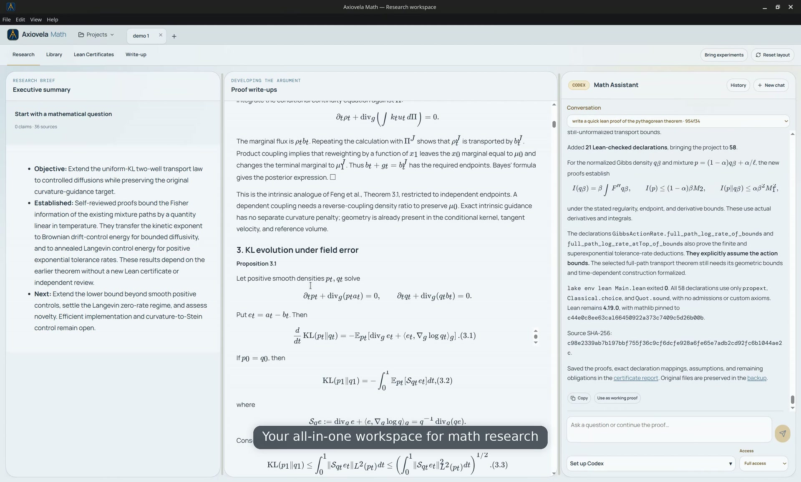

<p align="center"></p>

<h1 align="center">Axiovela Math</h1>

<p align="center"><strong>The AI mathematics research workbench.</strong><br />Turn a question into connected sources, precise claims, proofs, and a manuscript.</p>

<p align="center"><a href="#start-with-the-desktop-app">Install</a> · <a href="docs/getting-started.md">Get started</a> · <a href="#from-question-to-manuscript">Features</a> · <a href="docs/math-harness.md">Math harness</a> · <a href="docs/development.md">Documentation</a></p>

Axiovela Math keeps your sources, mathematical arguments, formal checks, and writing together in ordinary project files on your computer. Connect your AI provider, guide the work, and review the evidence at each step.

<p align="center"><a href="docs/demo/axiovela-math-demo.webm"></a></p>

<p align="center"><a href="docs/demo/axiovela-math-demo.webm"><strong>Watch the 43-second product tour</strong></a></p>

The mathematics companion to [Axiovela](https://github.com/CashBowman/axiovela), built around the same research and writing workflow.

**Private development.** This repository and its downloads require access. Linux x64 is validated; Windows and macOS preview downloads are available with native acceptance still pending. A public product release has not been approved.

## Keep research moving in parallel

Develop a proof, revise a manuscript, and explore another project at the same time.

- **Research and write together.** Run the Math Assistant and publication assistant simultaneously.
- **Move freely between projects.** Switch tabs without interrupting independent conversations.
- **Keep your context.** Research, Library, and Lean Certificates share a conversation; publication has its own.
- **Build on earlier attempts.** A background proof-attempt ledger retains saved approaches, outcomes, blockers and next steps across research conversations. Relevant summaries return as compact context, with older target revisions flagged and revisits linked to their predecessors. [Proof-attempt memory →](docs/proof-attempts.md)
- **Give precise feedback.** Highlight sentences or passages in summaries, proofs, papers, and previews. **Add to message** places feedback in the appropriate composer; you decide when to send it. [Passage annotations →](docs/annotations.md)

Consecutive turns within one conversation stay ordered. Provider limits and available compute still apply, and assistants in the same project share its files.

## From question to manuscript

1. **Ask.** Define the mathematical question, assumptions, and intended result with the Math Assistant.
2. **Read.** Import arXiv papers, PDFs, and web articles into the Library. Filter sources, retain your reading position, and explore their connections to claims and proofs.
3. **Develop.** Build claims, proposed theorems, lemmas, and arguments with explicit dependencies. Bring selected Axiovela experiments into saved evidence snapshots.
4. **Check.** Select a result in Lean Certificates to inspect its formalization and actual checker output. Keep conjectures, informal proofs, compiler success, and full certification distinct.
5. **Write.** Develop independent Markdown and LaTeX drafts with citations, PDF previews, source navigation, and export. New projects start with empty drafts.

Use **Projects** beside the tabs to reopen saved work, pin folders, or inspect explained connections between projects and imported experiments. The certificate outline follows the selected manuscript’s result numbers. [Projects and manuscript navigation →](docs/project-navigator.md)

Work saves automatically. Panels resize and retain their layout; **Reset layout** restores the current view. Connect Codex, Claude Code, Gemini CLI, OpenCode, Pi, or a supported API connection. [Connections and first session →](docs/getting-started.md)

Version **0.1.16-beta.1** adds project-based conversation History with search, persistent titles, pinning and archiving; preserves logical conversations across provider sessions; and keeps completed Math sessions out of Codex Recents without deleting history. Library and Lean results support keyboard navigation, and write-up questions and assessments stay in chat unless files are requested. [Conversation history →](docs/conversation-history.md) · [Release notes →](https://github.com/CashBowman/axiovela-math/releases/tag/v0.1.16-beta.1)

## Start with the desktop app

**Download 0.1.16-beta.1 · Private testing candidate**

This candidate is prepared as a draft release for owner testing. The buttons below become available after that release is published; the previous private preview remains available from [Releases](https://github.com/CashBowman/axiovela-math/releases).

The desktop downloads include the runtime and Tectonic for LaTeX rendering. Node.js and npm are not required. Sign in to GitHub with repository access to download. All builds were produced locally; no GitHub build jobs were used.

**Windows · x64 installer**

<a href="https://github.com/CashBowman/axiovela-math/releases/download/v0.1.16-beta.1/Axiovela-Math-0.1.16-beta.1-win32-x64-unsigned.exe"></a>

[Windows x64 · portable ZIP](https://github.com/CashBowman/axiovela-math/releases/download/v0.1.16-beta.1/Axiovela-Math-0.1.16-beta.1-win32-x64-unsigned.zip). Cross-built on Linux; unsigned and not yet launch-tested on Windows.

**macOS · Development app bundles**

<a href="https://github.com/CashBowman/axiovela-math/releases/download/v0.1.16-beta.1/Axiovela-Math-0.1.16-beta.1-darwin-arm64-unsigned.zip"></a>
<a href="https://github.com/CashBowman/axiovela-math/releases/download/v0.1.16-beta.1/Axiovela-Math-0.1.16-beta.1-darwin-x64-unsigned.zip"></a>

These are cross-built, unsigned app ZIPs for development, not finished Mac installers. Native signing, notarization, DMGs, and launch testing require a Mac and remain pending. [Mac build instructions →](docs/desktop-platforms.md#build-commands)

**Linux · Validated x64 packages**

<a href="https://github.com/CashBowman/axiovela-math/releases/download/v0.1.16-beta.1/Axiovela-Math-0.1.16-beta.1-linux-x64.AppImage"></a>

[Linux x64 · portable archive](https://github.com/CashBowman/axiovela-math/releases/download/v0.1.16-beta.1/Axiovela-Math-0.1.16-beta.1-linux-x64.tar.gz) · [Release notes and SHA-256 checksums](https://github.com/CashBowman/axiovela-math/releases/tag/v0.1.16-beta.1)

[Installation and first session](docs/getting-started.md) · [Platform status and local packaging](docs/desktop-platforms.md) · [Update details](docs/updates.md)

First LaTeX rendering may download TeX resources. On Linux, **Lean Certificates → Set up Lean** installs the compiler and project libraries, then runs a small installation test. Allow internet access and several GB for mathlib. Lean setup on Windows and Mac is currently manual.

**Help → Check for updates** explains private distribution; it does not authenticate to GitHub or fetch private downloads. Obtain updates from the release page. Close the app before installing an update; projects and app data remain separate from application files.

## Prefer to run from source?

With repository access, install Git and **Node.js 22.13+**, then run:

```sh
git clone https://github.com/CashBowman/axiovela-math.git
cd axiovela-math
npm ci
npm run desktop:start
```

For the browser development view, run `npm run dev` and open **http://127.0.0.1:5174**. For a production browser build, run `npm run build` followed by `npm start` and open **http://127.0.0.1:8791**. Keep the terminal running; **Ctrl+C** stops the service.

[Development and validation](docs/development.md) covers local packaging and isolated tests. GitHub builds must not run during this development phase. Tests use provider fixtures and make no paid model calls.

## Keep the mathematics under your control

- **Evidence first.** Sources, imported observations, proposed results, and proofs retain their own status. Experimental measurements do not become mathematical proofs.
- **Checks with clear limits.** A successful Lean entry-file build is not a whole-claim certificate. Linked theorems are checked for unfinished proofs and extra axioms. The assistant assesses whether the formal statements match the mathematical claims; Lean does not certify that translation. The [math harness](docs/math-harness.md) guides models and records execution; it is not a newly trained model or a guarantee of correctness.
- **Portable work.** Projects use ordinary files. Markdown and LaTeX drafts remain independent, with reversible backups for source changes.
- **Your provider.** AI connections use your account and may transmit selected project context or incur charges. Full access permits commands on your computer. Direct API connections do not automatically include web browsing.
- **Your data.** Projects and conversations stay on your computer. **File → Open app data folder** locates the desktop profile; back it up along with separately stored project folders. Desktop API keys require OS encryption; CLI sign-in remains with the provider. Browser previews use a separate, ignored `.workspace/` directory by default.

Repository source and installer packages exclude development workspaces, conversations, private reports, credentials, and signing keys.

[Prompt playbook](prompts/README.md) · [Third-party notices](docs/third-party.md) · [Report an issue](https://github.com/CashBowman/axiovela-math/issues)

MIT licensed; see [LICENSE](LICENSE).
