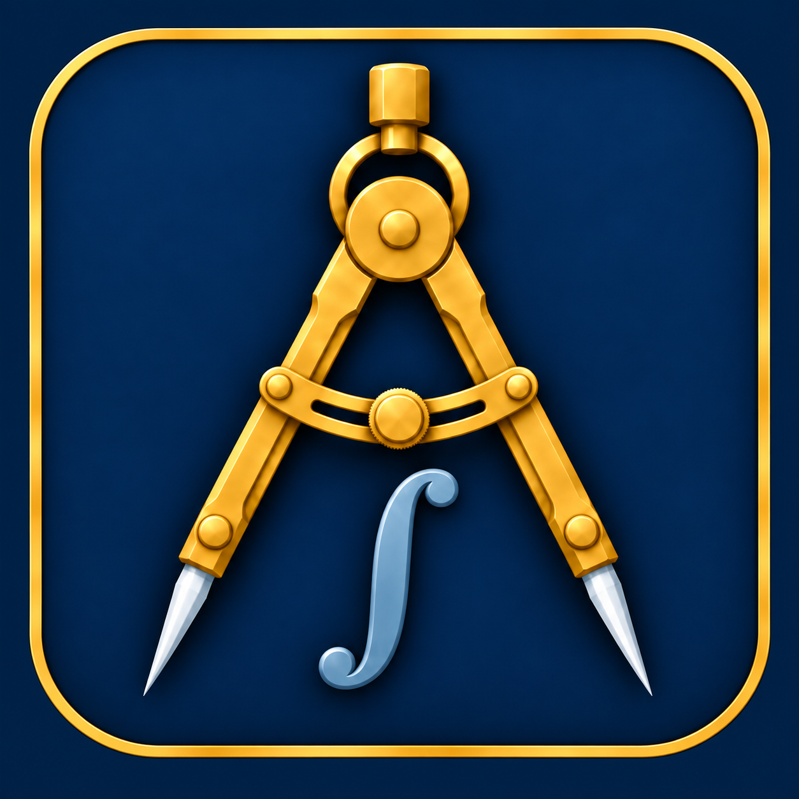
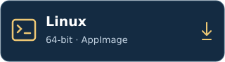

<p align="center"></p>

<h1 align="center">Axiovela Math</h1>

<p align="center"><strong>The AI mathematics research workbench.</strong><br />Turn a question into connected sources, precise claims, proofs, and a manuscript.</p>

<p align="center"><a href="#start-with-the-desktop-app">Install</a> · <a href="docs/getting-started.md">Get started</a> · <a href="#from-question-to-manuscript">Features</a> · <a href="docs/math-harness.md">Math harness</a> · <a href="docs/development.md">Documentation</a></p>

Axiovela Math keeps your sources, mathematical arguments, formal checks, and writing together in ordinary project files on your computer. Connect your AI provider, guide the work, and review the evidence at each step.

The mathematics companion to [Axiovela](https://github.com/CashBowman/axiovela), built around the same research and writing workflow.

**Private development.** This repository and its downloads require access. Linux x64 is validated; Windows and macOS builds are in development. A public product release has not been approved.

## Keep research moving in parallel

Develop a proof, revise a manuscript, and explore another project at the same time.

- **Research and write together.** Run the Math Assistant and publication assistant simultaneously.
- **Move freely between projects.** Switch tabs without interrupting independent conversations.
- **Keep your context.** Research, Library, and Lean Certificates share a conversation; publication has its own.
- **Give precise feedback.** Highlight sentences or passages in summaries, proofs, papers, and previews. **Add to message** places feedback in the appropriate composer; you decide when to send it. [Passage annotations →](docs/annotations.md)

Consecutive turns within one conversation stay ordered. Provider limits and available compute still apply, and assistants in the same project share its files.

## From question to manuscript

1. **Ask.** Define the mathematical question, assumptions, and intended result with the Math Assistant.
2. **Read.** Import arXiv papers, PDFs, and web articles into the Library. Filter sources, retain your reading position, and explore their connections to claims and proofs.
3. **Develop.** Build claims, proposed theorems, lemmas, and arguments with explicit dependencies. Bring selected Axiovela experiments into saved evidence snapshots.
4. **Check.** Select a result in Lean Certificates to inspect its formalization and actual checker output. Keep conjectures, informal proofs, compiler success, and full certification distinct.
5. **Write.** Develop independent Markdown and LaTeX drafts with citations, PDF previews, source navigation, and export. New projects start with empty drafts.

Work saves automatically. Panels resize and retain their layout; **Reset layout** restores the current view. Connect Codex, Claude Code, Gemini CLI, OpenCode, Pi, or a supported API connection. [Connections and first session →](docs/getting-started.md)

## Start with the desktop app

The desktop app includes its runtime and Tectonic for LaTeX rendering. You do not need Node.js or npm to run a packaged app. Repository access is required to download the current private Linux release.

**Linux · Validated x64 release**

<a href="https://github.com/CashBowman/axiovela-math/releases/download/v0.1.13/Axiovela-Math-0.1.13-linux-x64.AppImage"></a>

[Linux x64 · portable archive](https://github.com/CashBowman/axiovela-math/releases/download/v0.1.13/Axiovela-Math-0.1.13-linux-x64.tar.gz) · [Release notes and checksums](https://github.com/CashBowman/axiovela-math/releases/tag/v0.1.13)

**Windows · Private development build**

<a href="docs/desktop-platforms.md#build-commands"></a>

**macOS · Private development builds**

<a href="docs/desktop-platforms.md#build-commands"></a>
<a href="docs/desktop-platforms.md#build-commands"></a>

Windows and Mac buttons open the local build guide. The current development outputs are an unsigned Windows x64 installer and unsigned Mac app bundles; they have not been uploaded as downloads. Native Windows/Mac acceptance remains pending. Mac DMG creation and signing require a Mac. [Build status and platform requirements →](docs/desktop-platforms.md)

[Installation and first session](docs/getting-started.md) · [Local packaging](docs/desktop-platforms.md) · [Update details](docs/updates.md)

First LaTeX rendering may download TeX resources. On Linux, **Lean Certificates → Set up Lean** installs the compiler and project libraries, then runs a small installation test. Allow internet access and several GB for mathlib. Lean setup on Windows and Mac is currently manual.

New development builds explain private distribution in **Help → Check for updates**. The earlier 0.1.13 Linux download predates this change; obtain updates directly from the project owner while the repository is private. Installation remains manual, and projects and app data stay separate from application files.

## Prefer to run from source?

With repository access, install Git and **Node.js 22.13+**, then run:

```sh
git clone https://github.com/CashBowman/axiovela-math.git
cd axiovela-math
npm ci
npm run desktop:start
```

For the browser development view, run `npm run dev` and open **http://127.0.0.1:5174**. For a production browser build, run `npm run build` followed by `npm start` and open **http://127.0.0.1:8791**. Keep the terminal running; **Ctrl+C** stops the service.

[Development and validation](docs/development.md) covers local packaging and isolated tests. GitHub builds must not run during this development phase. Tests use provider fixtures and make no paid model calls.

## Keep the mathematics under your control

- **Evidence first.** Sources, imported observations, proposed results, and proofs retain their own status. Experimental measurements do not become mathematical proofs.
- **Checks with clear limits.** A successful Lean entry-file build is not a whole-claim certificate. Statement correspondence, assumptions, dependencies, and axioms still need review. The [math harness](docs/math-harness.md) guides models and records execution; it is not a newly trained model or a guarantee of correctness.
- **Portable work.** Projects use ordinary files. Markdown and LaTeX drafts remain independent, with reversible backups for source changes.
- **Your provider.** AI connections use your account and may transmit selected project context or incur charges. Full access permits commands on your computer. Direct API connections do not automatically include web browsing.
- **Your data.** Projects and conversations stay on your computer. **File → Open app data folder** locates the desktop profile; back it up along with separately stored project folders. Desktop API keys require OS encryption; CLI sign-in remains with the provider. Browser previews use a separate, ignored `.workspace/` directory by default.

Repository source and installer packages exclude development workspaces, conversations, private reports, credentials, and signing keys.

[Prompt playbook](prompts/README.md) · [Third-party notices](docs/third-party.md) · [Report an issue](https://github.com/CashBowman/axiovela-math/issues)

MIT licensed; see [LICENSE](LICENSE).
