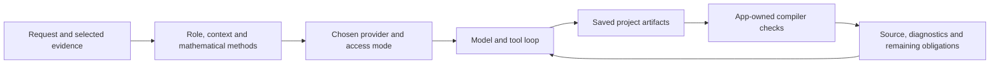

# How the mathematics harness works

A harness is the application code around a model: it supplies context, exposes tools, records results and defines what counts as evidence. Axiovela Math reuses Axiovela's MIT-licensed provider adapters and adds mathematical research instructions, project artifacts and verification workflows. No model weights were trained or fine-tuned for this app.

## What was built

1. **A shared research conversation.** Research, Library and Lean Certificates use the same conversation. Switching panels changes the supplied context without resetting history or permissions. Publication uses a separate conversation and independent manuscript files.
2. **Mathematical methods, selected from the request.** [`shared/harness.mjs`](../shared/harness.mjs) combines role guidance with the recipes in [`shared/research.mjs`](../shared/research.mjs): clarify assumptions, inspect primary literature, search for counterexamples, compare proof routes, audit an inference, construct exact witnesses, investigate novelty, formalize, and prepare a manuscript. These are instructions available to one assistant, not a compulsory checklist or separate agents.
3. **Project context and execution.** [`server/chat.mjs`](../server/chat.mjs) supplies the original question, current draft, selected source or experiment, evidence index, access mode and relevant history. It resumes provider sessions where supported and records turns, tool events, usage reported by the provider, cancellation and queued follow-ups. Context has size limits; large documents still require targeted file retrieval.
4. **Real tools with real permission boundaries.** The imported [`server/axiovela/`](../server/axiovela/) adapters execute CLI or direct-API work. Read-only access restricts changes; project editing permits file work; full access permits requested commands. Direct APIs expose project tools, but do not automatically acquire browser search or PDF-reading capabilities. A PDF being present in the library does not mean a model has read it.
5. **Artifacts separated by purpose.** Exploratory summaries and arguments live in `research/`; formal source and mathematical correspondence notes live in `certificates/`; final Markdown and LaTeX drafts live independently in `writeups/`. Imported experiment captures preserve measured results separately from the user's interpretation.
6. **Verification independent of model verdicts.** [`server/lean-workspace.mjs`](../server/lean-workspace.mjs) tracks saved formal source and app-owned records. [`server/checks.mjs`](../server/checks.mjs) invokes actual local tools. Installation readiness, an entry-file build, axiom checks, correspondence with the intended theorem, and complete certification remain distinct. Editing the source makes an earlier check stale.

For example, “does this numerical pattern imply a dimension-independent bound?” should first lead to inspection of the captured measurements and exact quantifiers, then a cheap counterexample or decisive lemma. Formalizing a weaker statement and reporting it as the original target would violate the harness's evidence contract. Instructions encourage that behavior; they do not establish that every model will follow it.

## Why optional claims exist

A claim records a particular statement and revision so that a paper, experiment or review can refer to the same mathematical target. If a hypothesis changes, an earlier supporting relationship may no longer apply. This is the engineering rationale for revisioned claims: explicit referents and traceability.

The feature is optional. It does not gate conversation or formalization, and adding a claim does not establish its truth. It was not derived from a validated study showing that this exact interface improves mathematical research. Likewise, a source's read checkbox is a user's reading state, not evidence that the assistant read it or that its theorem applies.

## What is not established

- This is one adaptive tool-using workflow by default, with no automatic swarm or independent reviewer. Asking the same conversation to audit itself is self-review.
- The direct-API loop stops after 40 tool rounds; CLI runtimes have their own execution behavior. A suggested dollar budget is not an enforced spending ceiling.
- Build success can certify only what was actually checked. It does not establish statement fidelity, absence of inappropriate assumptions, novelty or publication readiness.
- Prompt and fixture tests validate contracts, persistence and tool protocols. They do not benchmark mathematical discovery or validate a real paid provider account.

A credible effectiveness study would use frozen tasks, the same model and tool budget, a baseline without the mathematical guidance, independent grading of exact statements, and separate measures for correct proofs, counterexamples, false acceptance, time and cost. No such comparative evaluation is claimed for this release.

## Reading and reviewing a manuscript

Comments store a quote or location and the source/bibliography revision. Earlier comments remain stored after edits and can be exported. Current notes can be reopened through their margin pins or unsent composer blurbs. They do not silently modify the manuscript and are not embedded annotations in the exported PDF.

The PDF viewer uses PDF.js. Tectonic emits SyncTeX records during compilation; the app selects a nearby source record for a clicked PDF position. This is an approximate line-level map for the main manuscript, not character-level mapping or recovery of source from an imported paper. Changed LaTeX or bibliography triggers a debounced refresh; navigation waits for the current revision. Generated bibliographies and complex layouts can have limited correspondence. [Overleaf documents the same underlying SyncTeX mechanism and its limitations](https://docs.overleaf.com/navigating-in-the-editor/working-with-the-pdf-viewer/moving-between-the-editor-and-pdf).

The review design takes source-linked notes from [Zotero's documented annotation workflow](https://www.zotero.org/support/pdf_reader) and uses native two-state reading checkboxes consistent with the [W3C checkbox pattern](https://www.w3.org/WAI/ARIA/apg/patterns/checkbox/). These are design precedents, not evidence of a measured usability improvement in this app.

## Manuscript annotation reviews

[Passage annotations](annotations.md) adds a narrowly scoped review path to the existing Publication Assistant. The server validates the user's attached notes against the current saved source and bibliography, captures their exact revision, and runs a fresh read-only provider turn. The normal conversation permissions remain unchanged. The app parses one complete proposed draft and requires an explicit comparison/acceptance action before replacing the selected format. Both the review snapshot and current editor state guard against stale acceptance. This is an application workflow built around an existing model, not an additional mathematical verifier.

## Preliminary papers and readable sources

Substantive research development now asks the assistant to save a preliminary paper in the user's selected Markdown or LaTeX format. Only an empty draft or the exact unchanged starter template is eligible for initial replacement. An existing draft calls for a separately saved proposal unless the user authorized revision. Greetings, brief explanations and Lean-only requests do not trigger paper creation. This is prompt guidance, not a guarantee that every provider will generate the file. The app displays actual saved artifacts and reviews conflicting edits; it never reports a paper merely because the model said it saved one.

Both research panels render Markdown, including documents returned inside a whole-document Markdown fence. Paper drafts remain independent of exploratory proof notes and formal Lean source. A preliminary paper must identify conjectures and unresolved obligations; it is not a certification or publication-readiness claim.

Codex's imported adapter originally replaced each completed agent message. Math now assembles messages by provider item ID, retains their order, streams text deltas and replaces only the matching item's draft with its completed text. Worker and historical-turn events remain excluded. Displayed follow-up suggestions populate an unsent composer; they do not initiate another model call.

## Automatic result outline

For substantial research, the assistant is instructed to save proposed claims, theorems, supporting lemmas and proof sketches to `research/connections.json` without requiring manual claim entry. Stable node IDs, explicit hypotheses, open obligations and a `mainResult` flag organize the outline. Each directed relationship needs a specific explanation; dependencies, source support and proof sketches remain interpretations. The Library, graph and certificate navigator read the same outline. This requires project-editing access and actual file writes; a chat description alone does not update the panels. Existing nodes and unrelated concurrent edits must be preserved.

Formalization instructions can map these result IDs to declarations in `certificates/certificate.json`. The assistant supplies correspondence notes and obligations. App-owned check records supply the project build status and named-theorem proof/axiom checks. The current checker does not issue complete result certificates, and successful compilation does not convert all proposed nodes into verified results.

## Background proof-attempt memory

Research turns now receive a bounded briefing from saved proof attempts across the project. Substantive work is instructed to checkpoint its exact scope, approach, outcome, labels, evidence references and next step. The server captures these as separate records under `research/attempts/records/`, including saved checkpoints from failed or interrupted turns. Target snapshots distinguish older statement revisions; explicit revisit links preserve corrections without erasing earlier routes. Local query ranking and optional targeted retrieval keep the complete history out of each prompt. Recording requires actual file writes, and an unsuccessful approach is not automatically a refutation. See [proof-attempt memory](proof-attempts.md) for the research basis, schema, retrieval limits and validation boundaries.

## Formal proof checks

After a successful build, the app checks linked declaration names, confirms they are theorems, and collects their transitive axioms. Proofs using `sorryAx` remain incomplete; nonstandard axioms are shown as extra assumptions. The standard allowlist is `propext`, `Classical.choice`, and `Quot.sound`. Changed formal source invalidates earlier checks. This uses the pinned project compiler, not an independent kernel replay or semantic comparison of natural-language claims.

The assistant owns routine formalization repair and statement matching. Instructions call for searching pinned mathlib sources, using Loogle when web tools are available, and checking candidate lemmas against the pinned version. Loogle is workflow guidance, not a dedicated integrated search tool or a guarantee that every turn queries it.
